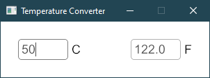
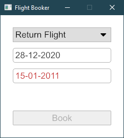
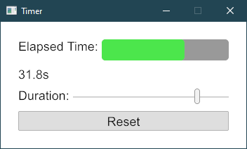
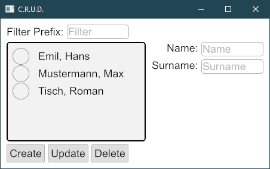

# Iced-7guis
## Rust implementation of the [7guis](https://eugenkiss.github.io/7guis/) tasks using [Iced](https://iced.rs)

### Counter  

### Temperature

### Flight Booker 

### Timer

### CRUD

### Circles (Not started)   

### Cells (Not started)  

